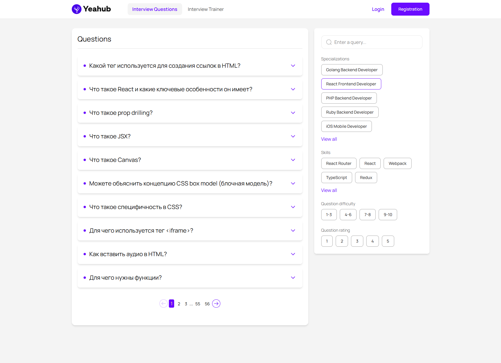

# Questions List App

Добро пожаловать в Questions List — современное, отзывчивое веб-приложение для просмотра, фильтрации и изучения вопросов для интервью. Построено на React и Vite для быстрой разработки и высокой производительности, приложение помогает пользователям готовиться к техническим интервью, предоставляя категоризированные вопросы с деталями, рейтингами и возможностью поиска. Оно следует архитектуре Feature-Sliced Design (FSD) для масштабируемости и поддерживаемости.

## Содержание

- [Технологический стек 🛠️](#технологический-стек)
- [Начало работы 🚀](#начало-работы)
- [Обзор структуры 📂](#бзор-структуры)
- [Деплой на Vercel 📦](#деплой-на-vercel)
- [Цель проекта 🎯](#цель-проекта)
- [Лицензия 📄](#лицензия)

## Функции ✨

Динамический список вопросов: Получение и отображение вопросов из backend-API с пагинацией, фильтрацией по специализации, навыкам, сложности, рейтингу и ключевым словам поиска.
Ленивая загрузка и скелетоны: Оптимизированная загрузка с использованием React lazy и Suspense для компонентов, плюс скелетоны для плавного пользовательского опыта во время загрузки данных.
Отзывчивый дизайн: Полностью адаптивный макет с использованием Tailwind CSS, с боковой панелью фильтров, видимой на больших экранах.
Управление состоянием: Redux Toolkit и RTK Query для эффективной обработки данных и кэширования.
Маршрутизация: React Router для плавной навигации между главной страницей, списком вопросов и отдельными страницами вопросов.
Обработка ошибок и пустых состояний: Грациозная обработка ошибок и пустых результатов с дружелюбными сообщениями.
Готово к деплою: Настроено для Vercel с серверлесс-прокси для обхода проблем CORS при запросах к внешним API.

### Приложение структурировано по принципам FSD, разделяя код на слои: entities, features, pages, shared и widgets для лучшей организации и повторного использования.

## Технологический стек 🛠️

- Фронтенд: [React 19](https://react.dev/blog/2024/12/05/react-19), [React Router 7](https://reactrouter.com/)
- Управление состоянием: [Redux Toolkit 2](https://redux-toolkit.js.org/), [React Redux 9] (https://react-redux.js.org/)
- Обработка API: [RTK Query](https://redux-toolkit.js.org/rtk-query/overview)
- Стилизация: [Tailwind CSS 4](https://tailwindcss.com/blog/tailwindcss-v4) с PostCSS и Autoprefixer
- Инструмент сборки: [Vite 5](https://vite.dev/blog/announcing-vite5) для сверхбыстрого HMR и сборок
- [TypeScript](https://www.typescriptlang.org/)
- Деплой: [Vercel](https://vercel.com/) с серверлесс-функциями для проксирования API-запросов

## Начало работы 🚀

Требования

Node.js 18+ (рекомендуется LTS-версия)
npm или yarn

Установка

1. Клонируйте репозиторий:

```sh
git clone https://github.com/yourusername/questions-list.git
cd questions-list
```

2. Установите зависимости:

```sh
npm install
```

3. Настройте переменные окружения (создайте `.env.local`):

```sh
VITE_API_BASE_URL=https://api.yeatwork.ru  # URL вашего backend-API
```

Запуск локально

Режим разработки (с HMR):

```sh
npm run dev
```

Откройте http://localhost:3000 в браузере.
Сборка для продакшена:

```sh
npm run build
```

Предпросмотр preview:

```sh
npm run build
```

Линтинг кода:

```sh
npm run lint
```

## Обзор структуры 📂

entities/: Основные модели домена (например, вопрос, навык).
features/: Логика, специфичная для фич (например, фильтры, пагинация).
pages/: Компоненты уровня страниц (например, QuestionsPage, QuestionPage).
shared/: Повторно используемые UI и утилиты (например, Loader, Skeleton, Pagination).
widgets/: Составные UI-блоки (например, QuestionsList, Filters).
api/: Серверлесс-функции Vercel для проксирования API-запросов.

## Деплой на Vercel 📦

Запушьте код на GitHub.
Войдите в Vercel и подключите репозиторий GitHub.
В дашборде Vercel создайте новый проект и импортируйте репозиторий.
Добавьте переменную окружения в Settings > Environment Variables:
Name: VITE_API_BASE_URL
Value: https://api.yeatwork.ru

## Зачем вы разработали этот проект?

Чтобы был

## Лицензия 📄

Лицензия MIT. См. LICENSE для деталей.

Questions List App
Header Image  
Welcome to Questions List, a modern, responsive web application designed for browsing, filtering, and exploring interview questions. Built with React and Vite for fast development and performance, this app helps users prepare for technical interviews by providing categorized questions with details, ratings, and search capabilities. It follows the Feature-Sliced Design (FSD) architecture for scalability and maintainability.
Features ✨

Dynamic Question Listing: Fetch and display questions from a backend API with pagination, filtering by specialization, skills, complexity, rate, and search keywords.
Lazy Loading & Skeletons: Optimized loading with React lazy and Suspense for components, plus skeleton screens for a smooth user experience during data fetching.
Responsive Design: Fully mobile-friendly layout using Tailwind CSS, with sidebar filters visible on larger screens.
State Management: Redux Toolkit and RTK Query for efficient data handling and caching.
Routing: React Router for seamless navigation between home, questions list, and individual question pages.
Error Handling & Empty States: Graceful handling of errors and empty results with user-friendly messages.
Deployment Ready: Configured for Vercel with serverless proxy to bypass CORS issues when fetching from external APIs.

The app is structured using FSD principles, dividing code into layers: entities, features, pages, shared, and widgets for better organization and reusability.
Tech Stack 🛠️

Frontend: React 19, React Router 7
State Management: Redux Toolkit 2, React Redux 9
API Handling: RTK Query for efficient queries and mutations
Styling: Tailwind CSS 4, with PostCSS and Autoprefixer
Build Tool: Vite 5 for lightning-fast HMR and builds
TypeScript: Full type safety with ESLint for code quality
Deployment: Vercel with serverless functions for API proxying
Other: Clsx for class name utilities, Radix UI for accessible components

Getting Started 🚀
Prerequisites

Node.js 18+ (LTS recommended)
npm or yarn

Installation

Clone the repository:textgit clone https://github.com/yourusername/questions-list.git
cd questions-list
Install dependencies:textnpm install
Set up environment variables (create .env.local):textVITE_API_BASE_URL=https://api.yeatwork.ru # Your backend API URL

Running Locally

Development mode (with HMR):textnpm run devOpen http://localhost:3000 in your browser.
Build for production:textnpm run build
Preview the build:textnpm run preview
Lint the code:textnpm run lint

Structure Overview 📂
The project follows Feature-Sliced Design (FSD) for modularity:

entities/: Core domain models (e.g., question, skill).
features/: Feature-specific logic (e.g., filters, pagination).
pages/: Page-level components (e.g., QuestionsPage, QuestionPage).
shared/: Reusable UI and utils (e.g., Loader, Skeleton, Pagination).
widgets/: Composable UI blocks (e.g., QuestionsList, Filters).
api/: Vercel serverless functions for proxying API requests.

Deployment to Vercel 📦

Push your code to GitHub.
Log in to Vercel and connect your GitHub repo.
In Vercel dashboard, create a new project and import your repo.
Add environment variable in Settings > Environment Variables:
Name: VITE_API_BASE_URL
Value: https://api.yeatwork.ru

Deploy — Vercel automatically builds and hosts your app.
Custom domain (optional): Add in Domains section.

The vercel.json file configures rewrites for API proxying to handle CORS.
Contributing 👥
Contributions are welcome! Follow these steps:

Fork the repo.
Create a feature branch (git checkout -b feature/AmazingFeature).
Commit changes (git commit -m 'Add AmazingFeature').
Push to the branch (git push origin feature/AmazingFeature).
Open a Pull Request.

Please ensure code is linted and type-checked before PR.
License 📄
MIT License. See LICENSE for details.
Acknowledgments 🎉

Inspired by interview prep platforms like LeetCode and Glassdoor.
Thanks to xAI for AI assistance in development.

If you have questions or issues, open an Issue on GitHub. Happy coding! 🚀
